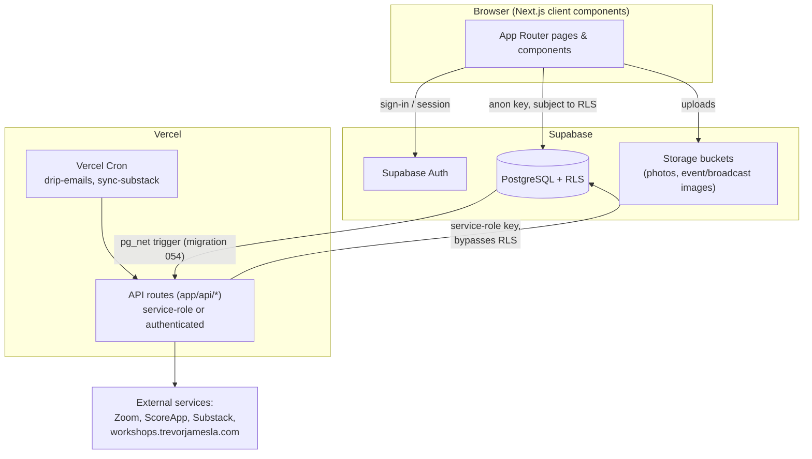

# Architecture

System-level explanation of how The Connection Room is built. For product
framing see [`README.md`](README.md); for the data model see
[`DATABASE_SCHEMA.md`](DATABASE_SCHEMA.md); for privacy rules see
[`PRIVACY_SECURITY_MODEL.md`](PRIVACY_SECURITY_MODEL.md).

## High-level architecture

Most reads and writes happen directly from client components using the
Supabase anon key (`lib/supabase/client.ts`) and are governed entirely by
Postgres Row Level Security. A small number of operations that legitimately
need to see across members' private data — connection matching, invite
resolution, admin actions, cron jobs, webhooks — go through a Next.js API
route using the Supabase **service-role key**, which bypasses RLS. Those
routes are responsible for only returning safe data back to the client; see
[`PRIVACY_SECURITY_MODEL.md`](PRIVACY_SECURITY_MODEL.md).

## Route structure

All routes below were confirmed to exist in `app/` at the time of this
writing.

**Public / marketing** (no auth): `/` (landing), `/faqs`, `/house-rules`,
`/philosophy`, `/brand-vision`.

**Auth**: `/auth` (sign-up/sign-in/admin-secret entry, all one page,
`app/auth/page.tsx`), `/auth/callback` (OAuth/email-link callback route
handler), `/auth/check-email`.

**Onboarding**: `/onboarding` — the initial profile-setup flow for new
members.

**Member app** (everything under `app/app/*`, wrapped by
`app/app/layout.tsx`, which redirects to `/auth` if `getSession()` doesn't
resolve to a signed-in user): the home dashboard (`/app`), `/app/spaces`
and `/app/spaces/[id]`, `/app/connections`, `/app/events`, `/app/journey`,
`/app/profile`, `/app/reflect`, `/app/articles`, `/app/quizzes` and its two
quiz sub-pages, `/app/users/[userId]`, `/app/about`.

**Member profile (public-ish, member-gated)**: `/members/[id]` — outside
the `/app` layout, but gated by its own auth check (added in migration
039's application refactor; previously had none at all).

**Admin** (`app/app/admin/*`, inside the member-app layout, additionally
gated by a client-side `session.type === "admin"` check plus RLS/API-level
checks — see "Admin architecture" below): `overview`, `members`, `events`,
`invites`, `broadcast`, `emails`, `moderation`, `concerns`, `activity`,
`daily-companion`, `sync-articles`.

**API routes** (`app/api/*`, all Route Handlers): `admin/broadcast-email`,
`admin/email-templates`, `admin/members/delete`, `admin/members/email`,
`admin/members/emails`, `admin/zoom/create-meeting`,
`admin/zoom/delete-meeting`, `matching/find`, `invites/friends`,
`report-bug`, `sync-substack`, `welcome-email`.

**Cron routes** (`app/api/cron/*`, called by Vercel Cron or an external
scheduler): `drip-emails`, `sync-substack`, `space-digest-emails`.

**Webhook routes** (`app/api/webhooks/*`): `new-post-notification` (called
by a Postgres trigger via `pg_net`, migration 054), `workshop-ops` (called
by the external workshop-ops app).

There is no `app/preview/` directory in this repository — a `/preview`
route does not currently exist.

## Dashboard architecture

The home dashboard (`app/app/page.tsx`) is explicitly structured as three
tiers, loaded progressively so the page renders useful content quickly
instead of blocking on everything at once:

1. **Today** — `DashboardTodaySection` (`components/dashboard/DashboardTodaySection.tsx`),
   backed by `useDashboardPrimaryData`. Renders `DailyCompanionDashboard`:
   today's theme, reflection prompt, embodiment practice, body check-in,
   conversation invitation, quote, and hero image. This is the
   above-the-fold, blocking content — the page shows its own loading state
   until this is ready.
2. **Continue** — `DashboardContinueSection`, backed by
   `useDashboardContinueData`. Renders `ContinueWhereYouLeftOff`: recent
   reflections and upcoming events, loaded non-blockingly.
3. **Explore** — `DashboardExploreSection`, backed by
   `useDashboardExploreData`. Renders journey progress (Seven Doors +
   Guided Rhythm), the newest article, theme-related content, the
   community members grid, an invite panel, "ways to connect," recent
   room reflections, upcoming events, and badges — the below-the-fold,
   optional/exploratory content.

**Design intention**: the dashboard is a companion, not a control panel. It
surfaces one thing to engage with today, then gently invites further
exploration — it is not built around metrics, streak counters, or a grid of
equally-weighted feature tiles.

## Daily Companion

`lib/data/daily-companion.ts` is the data source. Content rotation is
anchored to a single launch date (`getDaysSinceLaunch()`), hardcoded in that
file (`new Date("2026-07-20")` as of this writing — see
[`CHANGELOG.md`](CHANGELOG.md)), clamped to never go negative so a visit
before launch day shows Day 1 content instead of nothing.

- **Production data source**: `daily_companion_content` and
  `daily_companion_days` (migration 024), a 120-day rotation
  (`dayIndex = getDaysSinceLaunch() % 120`), and `weekly_notes` (referred to
  in code/content as `weeklyTrevorNotes`), a 16-week rotation
  (`weekIndex = getWeekSinceLaunch() % 16`).
- **Curated content model**: content is written once (seeded via migration
  025, or authored through the admin Daily Companion editor,
  `components/admin/DailyCompanionEditor.tsx` /
  `app/app/admin/daily-companion/page.tsx`) and then simply rotates through
  every member on the same schedule — it is not personalized per member.
- **Fallback/offline behavior**: if the Supabase query fails or times out,
  `getTrevorWeeklyNote()` and the daily-content equivalents fall back to the
  same rotation logic applied to static arrays in `lib/seed/daily-companion-content.ts`
  — this is a genuine fallback for outages, not the primary data path.
- **User reflections**: `user_reflections` (migration 024) stores a
  member's own responses; read/written only for the caller's own rows.
- **Weekly notes**: see above — these are the "This Week from Trevor" card
  and are surfaced through `WeeklyTrevorNoteCard`.

Distinguish this from the separate "Guided Rhythm" system
(`lib/data/guided-rhythm.ts`, `guided_rhythm_progress`,
`custom_rhythm_content`), which is a slower, month/week-oriented cadence
(monthly theme, weekly prompt, monthly integration) layered underneath the
daily rotation, not the same thing as the Daily Companion.

## Profile architecture

See [`PRIVACY_SECURITY_MODEL.md`](PRIVACY_SECURITY_MODEL.md) for full
detail; summarized here for system context.

- **Canonical private profile**: `profiles`. Every field a member has ever
  entered, readable only by its owner or an admin.
- **Community-visible profile**: `public_profiles`, a separate table holding
  only a curated, per-field-toggleable subset, kept in sync automatically by
  a trigger (`sync_public_profile`) that fires on every `profiles`
  write — no application write path needs to remember to update both
  tables.
- **Safe cross-member reads**: all cross-member reads go through
  `public_profiles_view`, a `security_invoker` view over `public_profiles`
  that additionally nulls out individual columns per the row owner's own
  `show_*` flags. Application code should never read `public_profiles` or
  `profiles` directly for another member's data.
- **Profile display controls**: `components/members/ProfileVisibilitySettings.tsx`
  reads/writes `public_profiles` directly (the sync trigger doesn't manage
  `show_*`/`profile_visibility`, since those are member-set preferences,
  not derived from the private profile).
- **RLS boundaries**: enforced at the table level on both `profiles` and
  `public_profiles`; the view adds column-level masking on top, which RLS
  itself cannot express.

`lib/data/profiles.ts` exports three distinct TypeScript types reflecting
this split: `Profile` (private), `CommunityProfile` (everything
`public_profiles_view` can return — structurally narrower on purpose), and
`ProfileVisibilitySettings` (the owner's own flags).

## Authentication and authorization

- **Sign-up/sign-in**: Supabase Auth, email/password (`app/auth/page.tsx`,
  `lib/auth/supabase.ts`). The same page also has an admin-secret entry
  path guarded by `NEXT_PUBLIC_DEMO_ADMIN_SECRET` (public env var, default
  fallback `"connection2024"` if unset — treat this as a low-security,
  legacy/demo affordance, not a real access control).
- **Session handling**: `lib/session.ts` maintains a client-side
  `AppSession` cached in `localStorage` (`connection-room:session`),
  derived from the signed-in user's `profiles.role` at login time
  (`"member"` or `"admin"`). This cached session drives client-side UI
  gating; it is not itself a source of truth for data access — RLS and
  server-side checks are.
- **Protected routes**: `app/app/layout.tsx` redirects to `/auth` if
  `getSession()` doesn't resolve to a signed-in user. This is a
  client-side redirect, not middleware — the underlying data is still
  protected by RLS regardless of whether this redirect fires.
- **Admin access**: two independent layers. (1) Client-side: admin pages
  check `session.type === "admin"` before rendering. (2) Server/data-side:
  RLS policies using `is_profile_admin(auth.uid())` (a dedicated,
  `STABLE`, non-inlinable SQL function — see
  [`DATABASE_SCHEMA.md`](DATABASE_SCHEMA.md#migration-history-notes) for
  why it went through several iterations), and API routes that need
  privileged access call `requireAdmin()` (`lib/auth/require-admin.ts`),
  which verifies the caller's Supabase access token server-side and checks
  `profiles.role === 'admin'` before proceeding — never trusts a
  client-sent flag.
- **JWT/role checks**: `requireAuth()` (`lib/auth/require-auth.ts`) is the
  weaker sibling of `requireAdmin()` — it verifies the caller is *any*
  signed-in member (used by `app/api/matching/find` and
  `app/api/invites/friends`, which need service-role access to private
  fields but not admin privileges); the route itself is responsible for
  only returning safe fields.
- **Anonymous restrictions**: RLS on `profiles`/`public_profiles` grants no
  policy to the `anon`/unauthenticated role — access defaults to deny.

## Admin architecture

Admin capabilities are split across dedicated pages under
`app/app/admin/*`: member management (including delete/email), events and
offers CRUD, broadcast email composition (with a rich-text editor and
image uploads to a dedicated Storage bucket), email template management,
moderation (post/comment deletion with an admin-bypass RLS policy, migration
052), a concerns/reports queue, an activity feed, Daily Companion content
authoring, and manual Substack article sync.

Every admin-only API route uses `requireAdmin()`. Admin pages themselves
are also protected at the RLS layer for any direct Supabase queries they
issue from the client (e.g. `profiles_admin_select`), so admin data access
is not solely dependent on the client-side page guard.

## Demo and preview architecture

**There is no runtime demo/preview session in this codebase.** Demo mode
(`lib/app-mode.ts`) is inferred purely from whether
`NEXT_PUBLIC_SUPABASE_URL`/`NEXT_PUBLIC_SUPABASE_ANON_KEY` are configured —
`isDemoMode()` returns `true` only when Supabase itself is unconfigured, not
in response to any user action, URL, or session flag. In the deployed
production environment, Supabase is always configured, so
`isDemoMode()` is always `false` there.

`lib/demo/demo-mode-guard.ts` provides `demoSafeWrite()` and related
helpers, used across several data-layer files to skip a Supabase write and
fall back to a `localStorage`/demo path — but this guard checks the exact
same environment-based `isDemoMode()`, so it is not an independent runtime
isolation mechanism; it's a consumer of the same signal.

There is no `app/preview/` route, and the landing page's calls to action
link to `/auth`, not a guest/demo bypass.

**Known limitation**: because demo mode is environment-based rather than a
runtime toggle, there is currently no way to give a specific visitor or
session a sandboxed, isolated demo experience against production — the
condition is all-or-nothing for the whole deployment. This has not caused a
live production issue (there's no reachable path into it in the current
production build), but if a `/preview` route or a runtime demo-session
toggle is added later, this conclusion needs to be re-verified rather than
assumed to still hold.

## Data access patterns

- **Self-profile reads/writes**: direct Supabase queries from client
  components against `profiles`, scoped by RLS to `user_id = auth.uid()`.
- **Cross-member reads**: always through `public_profiles_view` via helper
  functions in `lib/data/profiles.ts` (`getPublicProfile`,
  `getPublicProfilesBySpace`, `getDiscoverableMembers`) — never the raw
  `profiles` or `public_profiles` tables.
- **Admin reads**: either RLS-gated direct queries from admin pages (using
  `is_profile_admin()`), or `requireAdmin()`-gated API routes using the
  service-role key.
- **Direct Supabase access vs. API routes**: most of the app talks to
  Supabase directly from the client with the anon key. API routes exist
  specifically where server-side privilege is genuinely required
  (matching, invites, admin actions, cron, webhooks, Zoom/email
  integrations) — they are the exception, not the default pattern.
- **Data functions**: `lib/data/*.ts` — one file per feature area (posts,
  spaces, profiles, events, connections, badges, articles, etc.), each
  wrapping the relevant Supabase queries and, in several older files,
  a `localStorage` fallback for demo mode.
- **Hooks**: `lib/hooks/useDashboardPrimaryData.ts`,
  `useDashboardContinueData.ts`, `useDashboardExploreData.ts` implement the
  three-tier dashboard's progressive loading; `useAsyncData.ts` and
  `useToast.ts` are general-purpose.
- **Server-side vs. client-side boundaries**: anything using the
  service-role key must run server-side (API routes only — it is never
  exposed to the client). Everything else runs client-side against the
  anon key, relying on RLS.

## Extension points

- New profile fields that should be shareable follow the existing pattern:
  add to `profiles`, extend `sync_public_profile()`, add a paired `show_*`
  column and default, extend `public_profiles_view`'s masking, and extend
  the `CommunityProfile` type — see migration 053 for the reference
  implementation.
- New admin-only data access should get its own API route using
  `requireAdmin()` rather than relying solely on the client-side admin
  page guard, consistent with the existing pattern.
- New scheduled jobs beyond the two already in `vercel.json` may need an
  external scheduler (see `space-digest-emails`) rather than Vercel Cron,
  depending on the current Vercel plan's cron limits.
- The theme-tagging system (`theme_tags` JSONB columns on posts, spaces,
  events, articles, migration 028) is already in place as a generic
  "related to today's theme" discovery mechanism and could be extended to
  new content types without schema changes.
